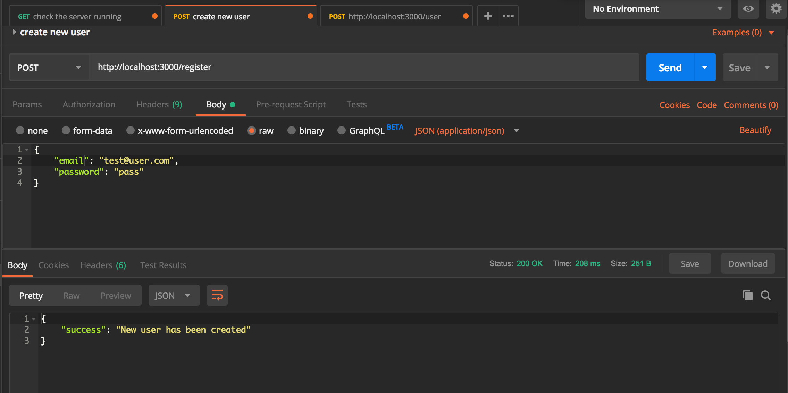
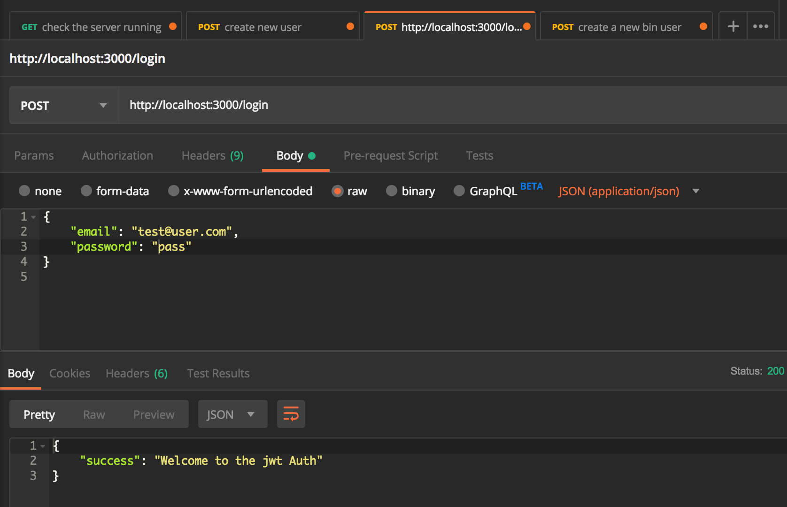
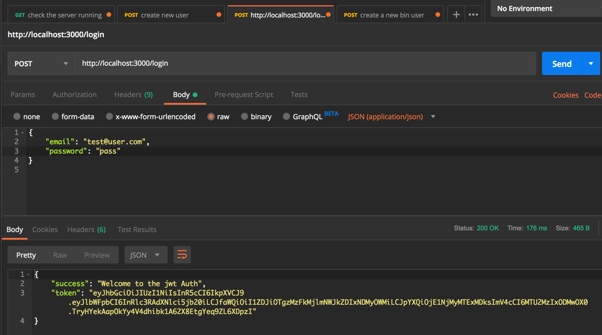

### Learn node js authentication with JSON Web Token
Following [tutorial](https://appdividend.com/2018/02/07/node-js-jwt-authentication-tutorial-scratch/)

Project is using:
 - express web framework
 - JWT package to authenticate user
 - mongoose schema model
 - body-parser middleware (support parsing of application/json type post data or support parsing of application/x-www-form-urlencoded post data)
 `body-parser extracts the entire body portion of an incoming request stream and exposes it on req.bod`
 - nodemon development server to prevent the stop and restart server while making changes in dev
 
 This Node.js application is connected to MongoDB database
  - Install MongoDB and make in run in the background:
    `brew services start mongodb`

